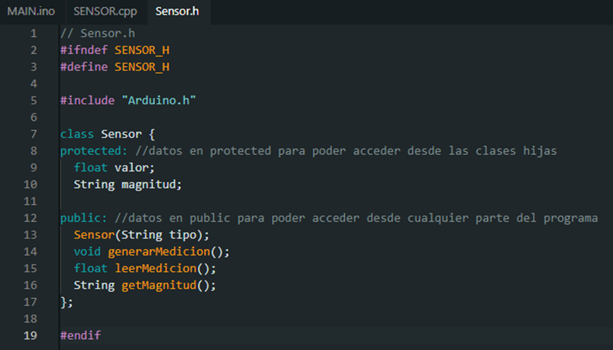
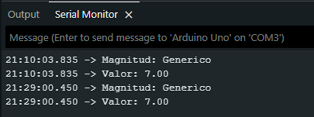

# TP_prog_orientada_objetos
En este repo se encuentra la información de los codigos utilizados para este TP. se incluye un esquematico generado en TinkerCad aunque el codigo ha sido puesto a prueba en un arduino real del cual también se adjunta una foto

1

1.1	Se generó un header (.h) y un Implementation (.cpp) para poder manejar las clases de sensores.

 
 
 
 
 
1.2	
En Main se definen más sensores y se printean los datos de los mismos

En sensor.cpp se agregan los constructores de las clases hijas e inicializan a la clase padre con las características de cada sensor para definir el tipo

En sensor.h se agrega la definición de las clases hijas y se hace un override del método generarMedicion() para que no se pisen datos randomizados de una llamada anterior

1.3
El código expresado en las capturas anteriores cumple con la consigna, mostrando por monitor serial los siguientes datos:

